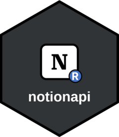

<!-- README.md is generated from README.Rmd. Please edit that file -->

```{r, include = FALSE}
knitr::opts_chunk$set(
  collapse = TRUE,
  comment = "#>",
  fig.path = "man/figures/README-",
  out.width = "100%"
)
```

# notionapi <a href="https://brenwin1.github.io/notionapi/"></a>

<!-- badges: start -->
[](https://github.com/brenwin1/notionapi/actions/workflows/R-CMD-check.yaml)
[](https://app.codecov.io/gh/brenwin1/notionapi)
<!-- badges: end -->

notionapi is an R client library for [Notion API](https://developers.notion.com/), enabling users to programmatically interact with their Notion workspaces. The package provides complete API coverage for managing pages and databases, managing content blocks, handling comments and retrieving user information.

The package is designed to mirror the [Official Notion JavaScript Client](https://github.com/makenotion/notion-sdk-js), using R6 classes to provide a familiar object-oriented interface and consistent API structure.

## Installation

Install the package from CRAN:

```{r}
#| eval: false
install.packages("notionapi")
```

Or install the development version from GitHub:

```{r}
#| eval: false
pak::pak("brenwin1/notionapi")
```

## Authentication

To initialise the Notion client, you need a Notion integration token.

1. **Create an integration** in your Notion workspace following [these instructions](https://developers.notion.com/docs/authorization#internal-integration-auth-flow-set-up).

2. **Copy the integration token** from your integration settings.

3. **Set the token** as an environment variable:

```{r}
#| eval: FALSE
usethis::edit_r_environ()
# add NOTION_TOKEN=<your_integration_token>
```

4. [Share pages/databases](https://developers.notion.com/docs/authorization#integration-permissions) with your integration in Notion.

5. **Restart your R session** to load the environment variable.

## Usage

Use `notion_client()` or `async_notion_client()` to create a client instance for accessing the API endpoints: 

The client organises methods into logical endpoint groups like pages, databases, and blocks. 
Each method maps directly to an endpoint, with parameters available as function arguments.

See the [Notion API reference](https://developers.notion.com/reference/intro) for complete endpoint documentation.

```{r}
library(notionapi)

# Create a Notion client instance
notion <- notion_client()

# Access the users endpoint to list all users in your Notion workspace
resp <- notion$users$list()
resp
```

API responses are automatically converted from JSON to R lists.

```{r}
# Extract specific fields from the response (list subsetting)
vapply(resp$results, "[[", "", "type")
```

### Serialisation

R data structures are automatically converted to the JSON format expected by the Notion API:

- `lists` → JSON object
- `list of lists` → JSON array

Examples are provided throughout the [reference documentation](https://brenwin1.github.io/notionapi/reference/index.html). See [CommentsEndpoint create()](https://brenwin1.github.io/notionapi/reference/CommentsEndpoint.html#ref-examples) method for an example.

### Pagination

See [Pagination](https://developers.notion.com/reference/intro#pagination) section in Notion API documentation for supported endpoints and implementation details. 

Pagination parameters (`page_size` and `start_cursor`) are exposed as function arguments. 

For an example, see [BlocksChildrenEndpoint retrieve()](https://brenwin1.github.io/notionapi/reference/BlocksChildrenEndpoint.html#ref-examples) method.
